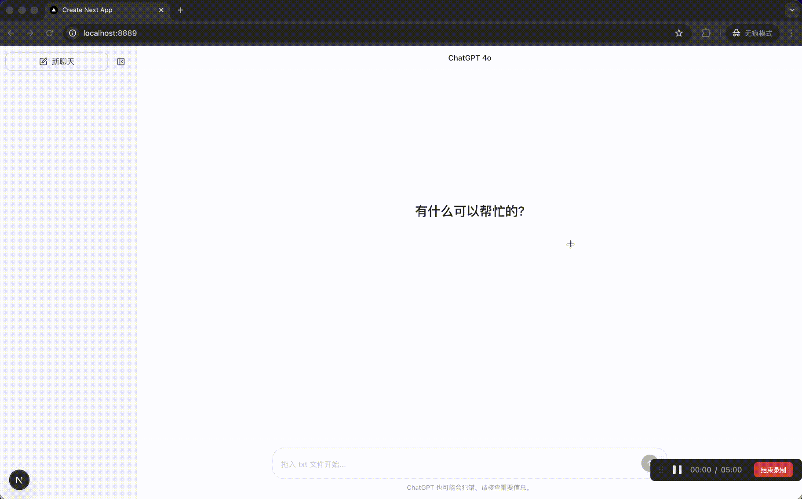

# 🎣 Chat Reader - AI 时代的摸鱼神器

> 一个伪装成 ChatGPT 的小说阅读器，让你在办公室"认真工作"的同时享受阅读的乐趣。

[](https://vercel.com/new/clone?repository-url=https://github.com/liuzhao1225/chat-reader)



## ✨ 功能特性

- **完美伪装** - 界面 1:1 还原 ChatGPT，白色主题，专业感十足
- **智能分章** - 自动识别「第X章」「Chapter X」等章节标题
- **流式输出** - 模拟 AI 打字效果，逐字显示小说内容
- **进度保存** - 使用 IndexedDB 存储，支持超大文件，刷新不丢失
- **拖拽上传** - 直接拖入 txt 文件即可开始阅读
- **多编码支持** - 自动识别 UTF-8 / GBK 编码

## 🚀 快速开始

### 在线部署（推荐）

点击上方 **Deploy with Vercel** 按钮，一键部署到 Vercel。

### 本地运行

```bash
# 克隆项目
git clone https://github.com/YOUR_USERNAME/chat-reader.git
cd chat-reader

# 安装依赖
npm install

# 启动开发服务器
npm run dev
```

打开 http://localhost:8889 开始使用。

## 📖 使用方法

1. **上传小说** - 将 `.txt` 文件直接拖入页面
2. **开始阅读** - 在输入框输入任意内容，按回车发送
3. **继续阅读** - 每次发送消息，会流式输出 3 个段落
4. **切换章节** - 点击左侧章节列表可跳转
5. **收起侧栏** - 点击收起按钮让界面更像 ChatGPT

## 🎭 摸鱼技巧

- 💡 收起左侧边栏，看起来就是在和 AI 聊天
- 💡 输入框可以打任何内容，比如「帮我分析一下这个需求」
- 💡 老板来了？直接切换到其他标签页
- 💡 建议配合真正的 ChatGPT 标签页使用，随时切换

## 🛠️ 技术栈

- **框架**: Next.js 16 + React 19
- **样式**: Tailwind CSS v4
- **组件**: shadcn/ui
- **存储**: IndexedDB（支持大文件）
- **语言**: TypeScript

## 📝 支持的章节格式

自动识别以下章节标题格式：

- `第一章`、`第1章`、`第一百二十三章`
- `第一节`、`第一回`、`第一卷`
- `Chapter 1`、`CHAPTER 1`
- `卷一`、`卷1`

## ⚠️ 免责声明

本项目仅供学习和娱乐目的。请在完成工作任务后适度摸鱼，合理安排工作与休息时间。

## 📄 License

MIT License

---

**🐟 祝你摸鱼愉快！**
